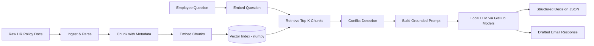

# HR Policy & Benefits Resolution Engine (Traditional RAG, built from scratch)

## The real corporate problem

Large companies (and especially healthcare/Medicaid-adjacent orgs like Gainwell) publish HR
policies as scattered PDFs/docs across regions (US, EU, etc.), and policies get **amended over
time** while old versions stay archived on the intranet. Two very real, very expensive failure
modes result:

1. **HR generalists and employees answer questions using outdated policy versions** (e.g., citing
   an old parental-leave policy that was superseded 2 years ago), causing incorrect pay,
   compliance risk, and rework.
2. **Region-specific rules get confused** (e.g., applying a US policy answer to an EU employee),
   again causing compliance risk.

This project builds a **traditional RAG (Retrieval-Augmented Generation) pipeline** that:

- Ingests HR policy documents (with metadata: region, doc id, version, effective date).
- Retrieves the most relevant, **most current**, region-correct policy chunks for a question.
- Detects when **multiple conflicting policy versions** are retrieved (e.g., v1.0 vs v2.0 of the
  same doc ID) and flags the answer for **human HR review** instead of silently guessing.
- Produces **two deliverables** per question, not just a chat reply:
  - A **structured decision object**: `{answer, cited_sections, confidence, conflict_flag, next_action}`
    — suitable for auto-populating a case management / ticketing system.
  - A **drafted response document**: a ready-to-send, cited email reply to the employee.

## Why "traditional" RAG (not agentic)

We deliberately build the classic linear pipeline so every step is transparent and debuggable:



No agents, no tool-calling loops, no multi-hop reasoning — just: ingest → chunk → embed → store →
retrieve → generate. This is the foundation every more advanced RAG system builds on.

## Tech stack (all free — no local GPU or paid API keys required)

| Concern              | Choice                          | Why |
|-----------------------|----------------------------------|-----|
| LLM (generation)      | [GitHub Models](https://github.com/marketplace/models) (`openai/gpt-4o-mini`) via OpenAI-compatible endpoint | Free tier, auth via your existing GitHub account (same one used for Copilot), reachable through corporate proxies that block other GenAI tools |
| Embeddings            | `scikit-learn` TF-IDF vectorizer | Fully offline, no model download, works around corporate network blocks on Hugging Face |
| Vector store          | Hand-rolled numpy brute-force cosine similarity (`vectorstore.py`) | No C-extension build tools required on Windows; teaches exactly how vector search works under the hood |
| Doc parsing           | `pypdf`, `python-docx`          | Handle real-world PDF/Word policy docs |
| Structured output     | `pydantic`                      | Validate/parse the LLM's JSON decision object |
| Interface             | Python CLI scripts (`scripts/`) | Learn the pipeline before adding UI complexity |

## Project structure

```
rag-chatbot/
├── data/
│   ├── raw/            # Source HR policy documents (.md/.pdf/.docx go here)
│   ├── processed/      # Generated: cleaned + chunked text (JSON)
│   └── vector_index/   # Generated: persisted embeddings.npy + metadata.json (gitignored)
├── src/hr_rag/
│   ├── config.py       # Central settings (paths, model names) from .env
│   ├── ingest.py       # Load raw docs -> plain text + metadata
│   ├── chunking.py     # Split text into overlapping chunks
│   ├── embeddings.py   # TF-IDF vectorizer (fit/transform, fully offline)
│   ├── vectorstore.py  # From-scratch numpy vector index (add/query)
│   ├── retrieval.py    # Top-K retrieval + conflict detection logic
│   ├── generation.py   # Prompt construction + GitHub Models call
│   ├── schemas.py       # Pydantic models for the structured decision output
│   └── pipeline.py     # Orchestrates ask(question) -> (decision, draft_email)
├── scripts/
│   ├── 01_ingest.py        # Step: parse + chunk data/raw -> data/processed
│   ├── 02_build_index.py   # Step: embed chunks -> populate vector index
│   └── 03_ask.py           # Step: interactive CLI to ask questions
├── tests/
├── requirements.txt
├── .env.example
└── README.md
```

## Learning roadmap (we build this step by step)

- [x] **Step 0** — Pick a real problem, choose tech stack (this doc).
- [x] **Step 1** — Project scaffold, dependencies, sample HR policy documents (incl. an
      intentionally superseded policy version, to exercise conflict detection later).
- [x] **Step 2** — Ingestion: parse `.md/.pdf/.docx` into plain text + metadata.
- [x] **Step 3** — Chunking strategy: fixed-size + overlap, why it matters, chunk metadata.
- [x] **Step 4** — Embeddings: turn chunks into vectors, store in a from-scratch numpy index.
- [x] **Step 5** — Retrieval: similarity search, top-K, metadata filtering by region.
- [x] **Step 6** — Conflict detection: same `doc_id`, different `version`/`effective_date` both
      retrieved -> flag instead of answering.
- [ ] **Step 7** — Generation: grounded prompt design, calling GitHub Models, forcing
      structured JSON output validated by Pydantic, plus a drafted email.
- [ ] **Step 8** — Wire it together into `scripts/03_ask.py`, an interactive CLI.
- [ ] **Step 9** — Evaluation: a small test set of Q&A pairs with expected citations, precision/
      recall on retrieval, manual grading of answer groundedness.
- [ ] **Step 10 (stretch)** — Streamlit UI, HR-reviewer feedback loop, re-ranking.

## Sample data (already created)

`data/raw/` contains 6 realistic HR documents, including a deliberate conflict:

- `parental_leave_policy_us_2021.md` (v1.0) **and**
  `parental_leave_policy_us_2023_amendment.md` (v2.0, supersedes v1.0) — same `doc_id`
  `HR-POL-US-014`, different terms. This is the conflict-detection test case.
- `parental_leave_policy_eu_2022.md` — different region, different rules (not a conflict, a
  legitimate regional difference — tests region-aware retrieval).
- `pto_policy_us_2024.md`, `health_insurance_benefits_us_2024.md`,
  `remote_work_policy_global_2023.md` — additional realistic policy documents.

## Setup

```powershell
cd rag-chatbot
python -m venv .venv
.\.venv\Scripts\Activate.ps1
pip install -r requirements.txt
copy .env.example .env
```

Requires a free GitHub personal access token with `models: read` permission, created at
[github.com/settings/personal-access-tokens](https://github.com/settings/personal-access-tokens),
set as `GITHUB_MODELS_TOKEN` in your `.env` file.
