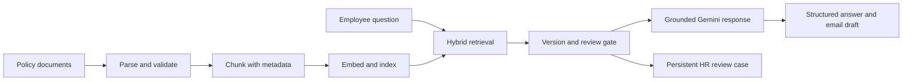

# HR Policy Resolution Engine

An end-to-end HR policy assistant that answers employee questions with region-aware retrieval, policy-version controls, citations, and human escalation.

## Highlights

- Ingests Markdown, text, PDF, and DOCX policy documents with structured metadata.
- Combines FAISS semantic search, BM25 keyword retrieval, and CrossEncoder reranking.
- Filters evidence by region and prioritizes the latest effective policy version.
- Detects version conflicts and routes uncertain cases to HR instead of guessing.
- Classifies policy area, intent, region, and employee type before retrieval.
- Uses Reciprocal Rank Fusion across semantic and keyword rankings, then reranks and deduplicates evidence.
- Validates evidence sufficiency and generated citations before returning an answer.
- Returns structured decisions with confidence, citations, and a ready-to-send email draft.
- Persists HR review cases in SQLite with status and reviewer notes.
- Includes retrieval evaluation, API metrics, configurable CORS, API-key protection, and Docker deployment artifacts.

## Architecture



LangGraph makes retrieval, version selection, review gating, and generation explicit. Query analysis extracts structured search criteria, expands short follow-ups with recent context, and applies metadata filters before retrieval. Reciprocal Rank Fusion combines FAISS and BM25 rankings, while deterministic evidence and citation gates run before an answer is returned.

## Stack

| Layer | Technology | Responsibility |
| --- | --- | --- |
| Frontend | React, Vite | Employee question and review workflow |
| API | FastAPI, Pydantic | Validated HTTP endpoints and structured responses |
| Workflow | LangGraph | Retrieval, version selection, review gates, and escalation |
| Retrieval | FAISS, BM25, CrossEncoder | Hybrid search and reranking |
| Models | Sentence Transformers, Gemini | Embeddings, reranking, and grounded generation |
| Persistence | JSON artifacts, SQLite | Policy index, evaluation data, and HR review cases |
| Deployment | Uvicorn, Docker Compose | Local and containerized execution |

## Project structure

```text
rag-chatbot/
├── backend/main.py          FastAPI API and frontend serving
├── src/hr_rag/
│   ├── ingest.py            Policy parsing and metadata validation
│   ├── chunking.py          Retrieval-sized policy chunks
│   ├── vectorstore.py       FAISS index and hybrid retrieval
│   ├── retrieval.py         Reranking and version handling
│   ├── workflow.py          LangGraph review workflow
│   ├── generation.py        Grounded structured responses
│   ├── review_store.py      Persistent HR review cases
│   └── evaluation.py        Retrieval evaluation metrics
├── data/raw/                Source policy documents
├── data/eval/               Evaluation questions and expected results
├── frontend/                React/Vite user interface
├── scripts/                 Ingestion, indexing, CLI, and evaluation commands
├── tests/                   API, retrieval, and persistence tests
├── Dockerfile               Container image definition
└── docker-compose.yml       Containerized local deployment
```

## Setup

```powershell
cd C:\hr_assist_po\rag-chatbot
python -m venv .venv
.\.venv\Scripts\Activate.ps1
pip install -r requirements.txt
pip install -e .
Copy-Item .env.example .env
```

Set `GEMINI_API_KEY` in `.env`, then build and evaluate the local policy index:

```powershell
python scripts/01_ingest.py
python scripts/02_build_index.py
python scripts/04_evaluate.py
```

Start the API:

```powershell
python -m uvicorn backend.main:app --reload
```

Start the frontend in another terminal:

```powershell
cd frontend
npm install
npm run dev
```

Open <http://localhost:5173>. API documentation is available at <http://127.0.0.1:8000/docs>.

For a containerized run:

```powershell
docker compose up --build
```

## API

- `POST /api/ask` answers a policy question.
- `GET /api/chat-history` returns saved questions and answers.
- `POST /api/send-to-hr` creates and sends an HR review case.
- `GET /api/reviews` lists persisted review cases.
- `PATCH /api/reviews/{case_id}` updates a case.
- `GET /api/metrics` returns application counters.

The evaluation module also provides groundedness and citation-accuracy metrics for saved model decisions.

## Sample data

The sample corpus includes US and EU policies plus superseded parental-leave versions. This makes region filtering and policy-version conflict handling visible without requiring private company data.

Chat history and HR review cases are stored in SQLite at `data/review_cases.sqlite3`.
