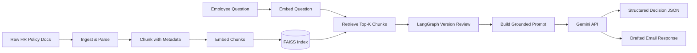

# HR Policy & Benefits Resolution Engine

## The real corporate problem

Large companies (and especially healthcare/Medicaid-adjacent orgs like Gainwell) publish HR
policies as scattered PDFs/docs across regions (US, EU, etc.), and policies get **amended over
time** while old versions stay archived on the intranet. Two very real, very expensive failure
modes result:

1. **HR generalists and employees answer questions using outdated policy versions** (e.g., citing
   an old parental-leave policy that was superseded 2 years ago), causing incorrect pay,
   compliance risk, and rework.
2. **Region-specific rules get confused** (e.g., applying a US policy answer to an EU employee),
   again causing compliance risk.

This project builds a grounded RAG (Retrieval-Augmented Generation) pipeline that:

- Ingests HR policy documents (with metadata: region, doc id, version, effective date).
- Retrieves the most relevant, **most current**, region-correct policy chunks for a question.
- Detects when **multiple policy versions** are retrieved (e.g., v1.0 vs v2.0 of the same doc ID),
  prefers the newest effective version, and exposes an older-version warning for auditability.
- Produces **two deliverables** per question, not just a chat reply:
  - A **structured decision object**: `{answer, cited_sections, confidence, conflict_flag, next_action}`
    — suitable for auto-populating a case management / ticketing system.
  - A **drafted response document**: a ready-to-send, cited email reply to the employee.

## Architecture

The application uses a controlled LangGraph workflow so every retrieval and HR-review decision
is explicit and debuggable:



LangChain handles document loading, splitting, embeddings, and FAISS retrieval. LangGraph routes
the evidence through latest-version selection, HR review when necessary, and grounded generation.
This is a controlled workflow rather than an open-ended tool-calling agent.

## Tech stack

| Concern              | Choice                          | Why |
|-----------------------|----------------------------------|-----|
| LLM (generation)      | [Google Gemini](https://ai.google.dev/gemini-api/docs/openai) via its OpenAI-compatible endpoint | Use a Gemini API key with the existing OpenAI SDK |
| Embeddings            | Hugging Face Sentence Transformers (`all-MiniLM-L6-v2`) | Semantic retrieval with normalized dense vectors; downloaded once and run locally |
| Reranking             | Sentence Transformers CrossEncoder (`ms-marco-MiniLM-L-6-v2`) | Reorders FAISS/BM25 candidates using question-to-chunk relevance |
| Vector store          | FAISS through LangChain (`vectorstore.py`) | Fast local nearest-neighbor search with metadata payloads |
| Doc parsing           | LangChain loaders (`PyPDFLoader`, `Docx2txtLoader`, `TextLoader`) | Consistent document ingestion across source formats |
| Workflow              | LangGraph | Explicit retrieval, version selection, and HR-review routing |
| Structured output     | `pydantic`                      | Validate/parse the LLM's JSON decision object |
| Interface             | React + Vite + FastAPI + CLI | A dedicated browser app over the HTTP API |

## Project structure

```
rag-chatbot/
├── data/
│   ├── raw/            # Source HR policy documents (.md/.pdf/.docx go here)
│   ├── processed/      # Generated: cleaned + chunked text (JSON)
│   └── vector_index/   # Generated: persisted FAISS index (gitignored)
├── backend/
│   ├── __init__.py       # Backend package marker
│   └── main.py           # FastAPI routes and static frontend serving
├── src/hr_rag/           # Domain and application layer
│   ├── config.py       # Central settings (paths, model names) from .env
│   ├── ingest.py       # LangChain loaders -> plain text + metadata
│   ├── chunking.py     # LangChain recursive text splitting
│   ├── embeddings.py   # Hugging Face semantic embedding model
│   ├── vectorstore.py  # LangChain FAISS index (add/query)
│   ├── workflow.py     # LangGraph retrieval and HR-review workflow
│   ├── retrieval.py    # Top-K retrieval + conflict detection logic
│   ├── generation.py   # Prompt construction + Gemini API call
│   ├── schemas.py       # Pydantic models for the structured decision output
│   ├── pipeline.py     # Orchestrates ask(question) -> (decision, draft_email)
├── frontend/           # React/Vite browser application
│   ├── src/
│   │   ├── App.jsx      # Main React workflow and result views
│   │   ├── main.jsx     # React entry point
│   │   └── styles.css   # Application styling
│   ├── package.json
│   └── vite.config.js   # Dev proxy: /api -> FastAPI
├── scripts/
│   ├── 01_ingest.py        # Step: parse + chunk data/raw -> data/processed
│   ├── 02_build_index.py   # Step: embed chunks -> populate vector index
│   └── 03_ask.py           # Step: interactive CLI to ask questions
├── tests/
├── requirements.txt
├── .env.example
└── README.md
```

## Learning roadmap (we build this step by step)

- [x] **Step 0** — Pick a real problem, choose tech stack (this doc).
- [x] **Step 1** — Project scaffold, dependencies, sample HR policy documents (incl. an
      intentionally superseded policy version, to exercise conflict detection later).
- [x] **Step 2** — Ingestion: parse `.md/.pdf/.docx` into plain text + metadata.
- [x] **Step 3** — Chunking strategy: fixed-size + overlap, why it matters, chunk metadata.
- [x] **Step 4** — Semantic embeddings: Hugging Face sentence-transformers with a FAISS index.
- [x] **Step 5** — LangChain FAISS retrieval: similarity search, top-K, metadata filtering by region.
- [x] **Step 6** — Version handling: same `doc_id`, different `version`/`effective_date` both
  retrieved -> use the newest effective version and show an audit warning.
- [x] **Step 7** — Generation: grounded prompt design, calling Gemini, forcing
      structured JSON output validated by Pydantic, plus a drafted email.
- [x] **Step 8** — LangGraph workflow, FastAPI endpoints, React frontend, and interactive CLI.
- [ ] **Step 9** — Evaluation: a small test set of Q&A pairs with expected citations, precision/
      recall on retrieval, manual grading of answer groundedness.
- [x] **Step 10** — FastAPI backend and React/Vite browser UI over the FAISS index.
- [x] **Step 11** — LangChain ingestion/retrieval and LangGraph HR-review workflow.
- [ ] **Step 12** — Evaluation set and persistent HR feedback.
- [x] **Step 12a** — Hybrid FAISS semantic + BM25 keyword retrieval.
- [x] **Step 12b** — Local CrossEncoder reranking over FAISS/BM25 candidates.

## Sample data (already created)

`data/raw/` contains 10 realistic HR documents, including a deliberate conflict:

  - `parental_leave_policy_us_2021.md` (v1.0, archived) **and**
  `parental_leave_policy_us_2023_amendment.md` (v2.0, supersedes v1.0) — same `doc_id`
  `HR-POL-US-014`, different terms. This is the conflict-detection test case.
- `parental_leave_policy_eu_2022.md` — different region, different rules (not a conflict, a
  legitimate regional difference — tests region-aware retrieval).
- `pto_policy_us_2024.md`, `health_insurance_benefits_us_2024.md`,
  `remote_work_policy_global_2023.md` — benefits, absence, and work-arrangement policies.
- `compensation_policy_us_2025.md` — salary bands, merit review, promotions, bonuses, and payroll.
- `performance_management_global_2025.md` — goals, check-ins, annual reviews, and PIPs.
- `employee_conduct_global_2025.md` — conduct standards, reporting, investigations, and non-retaliation.
- `career_development_global_2025.md` — development plans, learning budget, mentoring, and mobility.

## Setup

```powershell
cd C:\hr_assist_po\rag-chatbot
python -m venv .venv
.\.venv\Scripts\Activate.ps1
pip install -r requirements.txt
pip install -e .
Copy-Item .env.example .env
```

Requires a Gemini API key created at
[aistudio.google.com/apikey](https://aistudio.google.com/apikey), set as
`GEMINI_API_KEY` in your `.env` file.

## Run the backend and frontend

Build the local vector index once after ingestion:

```powershell
python scripts/01_ingest.py
python scripts/02_build_index.py
```

The first index build downloads the configured Hugging Face embedding model. The first query
also downloads the CrossEncoder reranker model. Generated FAISS files are written to
`data/vector_index/policy_faiss/` and are ignored by Git.

Start the FastAPI backend from the project root:

```powershell
python -m uvicorn backend.main:app --reload
```

In a second terminal, run the React development frontend:

```powershell
cd frontend
npm install
npm run dev
```

Open <http://localhost:5173>. Vite proxies `/api` requests to FastAPI on port 8000.
For a single-process production-style run, build React first with `npm run build`, then
start FastAPI and open <http://127.0.0.1:8000>; FastAPI serves `frontend/dist`.
Swagger remains at <http://127.0.0.1:8000/docs>. The local vector database is a
LangChain-managed FAISS index in `data/vector_index/policy_faiss/`, and the workflow
is orchestrated by LangGraph in `src/hr_rag/workflow.py`.
